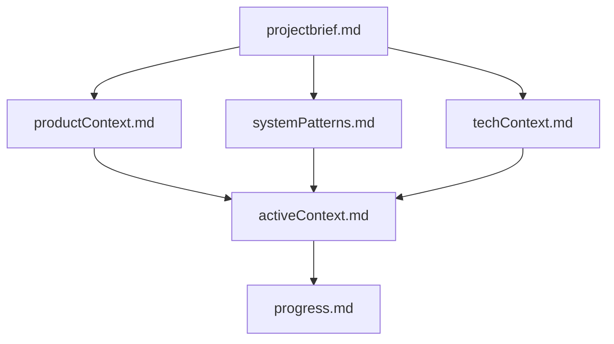

# Antigravity's Memory Bank

I am Antigravity, a powerful agentic AI coding assistant. My memory resets between sessions, so I rely on this Memory Bank to maintain continuity and context for the **Quatrix - CS2 Server Management Panel** project.

## Memory Bank Structure

The Memory Bank files are located in `memory-bank/` and follow this hierarchy:

### Core Files
1. `projectbrief.md`: Core requirements and goals (Source of truth).
2. `productContext.md`: User experience goals and functional requirements.
3. `systemPatterns.md`: System architecture (Native processes for CS2).
4. `techContext.md`: Tech stack (React, Node.js, Prisma, SQLite).
5. `activeContext.md`: Current focus, recent changes, and next steps.
6. `progress.md`: Feature status and roadmap.
7. `decisions.md`: Technical decisions and rationale (Critical: Native Architecture).
8. `architecture-overview.md`: Summary of the final chosen architecture.

## Recent Milestones (Phase 6 In Progress)

The project has achieved high stability and feature parity with professional panels:
- ✅ **System Monitoring**: Real-time CPU, RAM, and Disk usage tracking via `systeminformation` & WebSockets.
- ✅ **Config Editor**: Visual file editor with protection and automated path resolution.
- ✅ **Native Stability**: Resolved critical Windows-specific crashes (`USRLOCAL`, `k_EUniverseInvalid`) by implementing:
    - Dedicated `userdata` folder injection.
    - Automated `steam_appid.txt` management (AppID 730).
    - Isolated but complete Windows Environment Variable set (`USERPROFILE`, `APPDATA`, etc.).
- ✅ **Server Verification**: Integrated SteamCMD `validate` flow with real-time feedback via Terminal.
- ✅ **Management Tools**: Automated SteamCMD installation and server lifecycle management (Start/Stop/Kill).
- ✅ **Full Authentication Suite**: Secure JWT-based auth with Bcrypt password hashing.
- ✅ **Real-Time Terminal**: Xterm.js integration with bi-directional Socket.io streaming.
- ✅ **UI/UX Polish**: Multi-language support (TR/EN), Dark Mode, and Ant Design component optimization.

## Current Focus: Phase 6 - Advanced Management
- 🛠️ **Workshop Integration**: Automated map downloading and collection management.
- 🛠️ **Player Management**: Real-time player listing and RCON-based management (Kick/Ban).
- 🛠️ **Plugin Manager**: Simplified installation of Metamod:Source and SourceMod.

## Project Vision: Quatrix
Quatrix is built on the **"Full Native"** philosophy. Every component—from the CS2 game servers to the SQLite database—is optimized to run directly on the host system without the overhead of containerization, ensuring maximum performance and minimum latency.

## Operating Rules
- **Aesthetics First**: Every UI component must feel premium and state-of-the-art.
- **Security by Default**: All API routes (except Auth) require valid JWT tokens.
- **Process Stability**: Game servers must be managed carefully using `child_process` with robust cleanup handlers.

REMEMBER: I MUST read the Memory Bank at the start of every session to ensure I'm building exactly what the user needs. Precision and documentation are key to our success.
