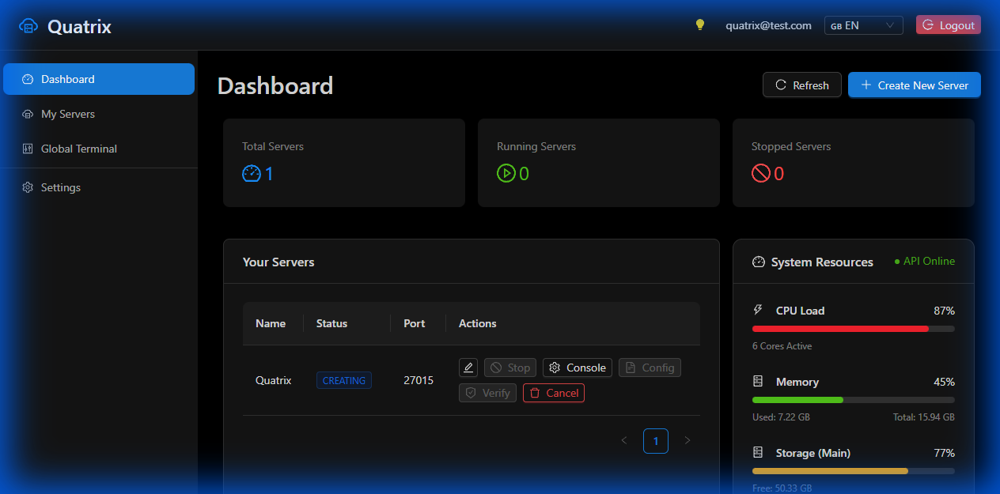
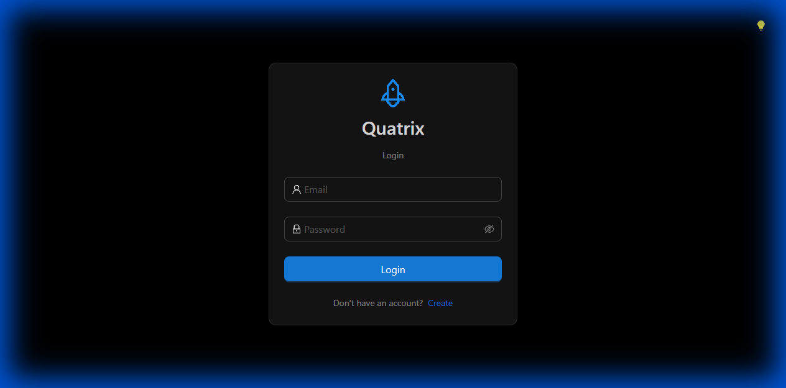
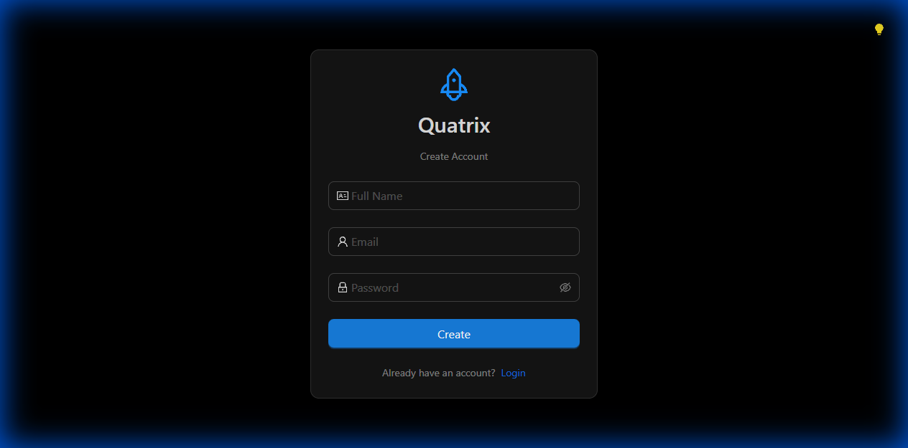
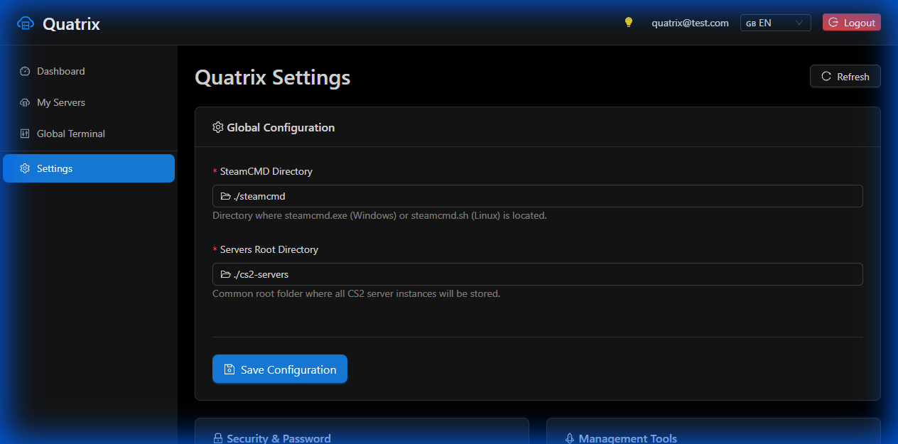

# 🎮 Quatrix - CS2 Server Management Panel

[](https://opensource.org/licenses/MIT)
[](https://nodejs.org/)
[](https://reactjs.org/)
[](https://www.prisma.io/)
[](https://ant.design/)

**Quatrix** is a premium, high-performance web-based management platform designed for **Counter-Strike 2** dedicated servers. Built with a focus on **native performance**, Quatrix allows you to deploy, manage, and monitor your servers directly on your host machine with an industry-leading user interface.

> [!WARNING]
> **Development Stage:** This project is built with **Vibecoding** and is currently in the active development phase. Some features may be incomplete or contains stability issues.



---

## ✨ Key Features

- 🚀 **One-Click Deployment**: Deploy CS2 servers instantly using integrated SteamCMD automation.
- 📁 **Advanced File Manager**: High-performance filesystem management with bulk operations, Recycle Bin (`.quatrix_trash`), bi-directional Zip support, and clipboard (Cut/Paste) functionality.
- 🌍 **Steam Workshop Support**: Seamlessly manage Workshop collections and maps with database persistence and visual configuration.
- 📊 **Real-Time Monitoring**: Live tracking of System Resources (CPU, RAM, Storage) via WebSockets.
- 💻 **Pro Terminal**: Robust Xterm.js console integration for live logs and bi-directional RCON commands.
- 📝 **Visual Config Editor**: Manage `.cfg`, `.json`, and `.txt` files through a secure, full-screen web-based editor.
- 🌓 **Dynamic Themes**: Seamless switching between **Dark** and **Light** modes across all pages.
- 🌍 **Bilingual Support**: Full support for **English** and **Turkish** languages.
- 📱 **Responsive UI 2.0**: Fully adaptive dashboard optimized for Desktop, Tablet, and Mobile devices without horizontal overflow.
- 👤 **User Management**: Secure authentication system (JWT + Bcrypt) with individualized server ownership.

---

## 📸 Screenshots

<details>
<summary>View More Screenshots</summary>

### Login Page


### Register Page


### Settings Page


</details>

---

## 🏗️ Technology Stack

| Component | Technology |
| :--- | :--- |
| **Frontend** | React 18, Vite, Ant Design 5, Socket.io-client, Xterm.js |
| **Backend** | Node.js (ESM), TypeScript, Express, Socket.io, Multer, Systeminformation |
| **Database** | SQLite, Prisma ORM |
| **Automation** | SteamCMD (Native Integration) |

---

## 🚀 Installation & Setup

### 1. Prerequisites
- **Node.js**: v18.0 or higher
- **SteamCMD**: Installed on the host system (Windows recommended for Native performance)
- **OS**: Windows (Full Native Support)

### 2. Backend Setup
```bash
cd backend
npm install
npx prisma generate
npx prisma migrate dev
npm run dev
```

### 3. Frontend Setup
```bash
cd frontend
npm install
npm run dev
```

### 4. Initial Configuration
1. Open `http://localhost:5173`.
2. Register and Login.
3. Configure your **SteamCMD Path** and **Servers Root Path** in the settings.

---

## 📁 Project Structure

```text
quatrix/
├── backend/            # Node.js ESM API & Process Management
│   ├── src/services/   # SteamCMD, RCON, and Terminal logic
│   └── prisma/         # SQLite Schema and Migrations
├── frontend/           # React 18 Dashboard
│   ├── src/components/ # Advanced UI Components (FileManager, Console)
│   └── src/pages/      # Dashboard and Auth views
├── screenshots/        # Visual documentation
└── README.md           # Project Overview
```

---

## 🛣️ Roadmap

- [x] **Phase 6**: Steam Workshop Integration (Workshop Map Manager).
- [x] **Phase 6**: Advanced File Manager (Search, Archive, Trash).
- [ ] **Phase 6**: RCON-based Player Management (Kick/Ban UI).
- [ ] **Phase 7**: Plugin Manager (Metamod/Sourcemod auto-installer).
- [ ] **Phase 8**: Detailed Server Backups & Automatic Updates.

---

## 📄 License

This project is licensed under the MIT License - see the [LICENSE](LICENSE) file for details.

---

**Developed with ❤️ with Vibecoding.**  
*Disclaimer: This project is not affiliated with Valve Corporation.*
